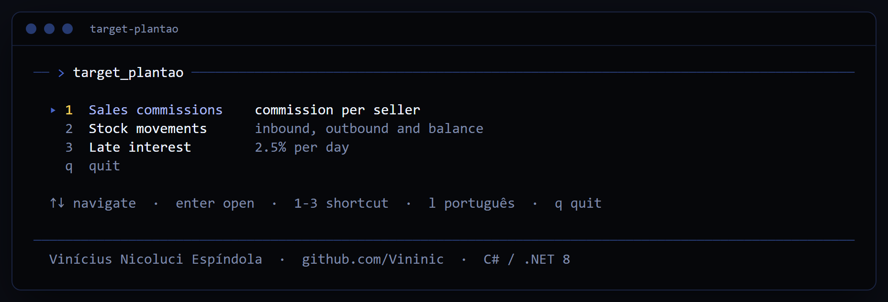
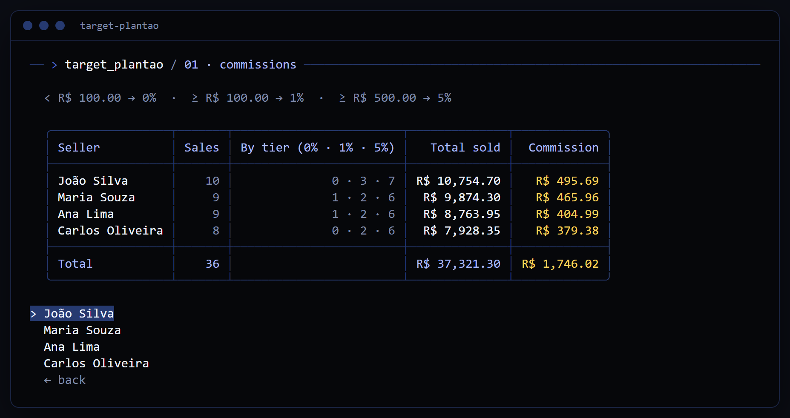
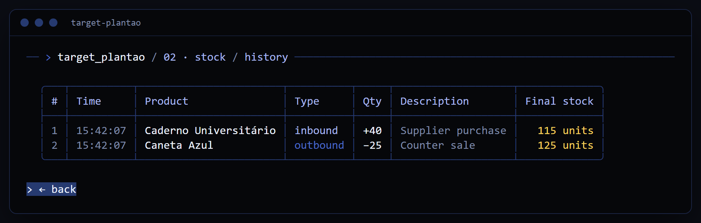
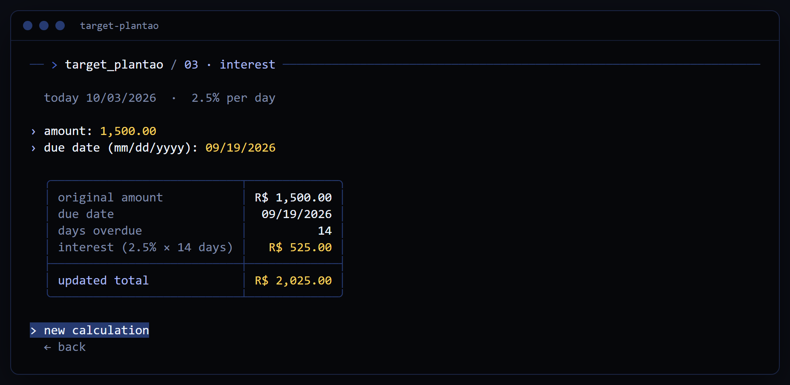

# Technical challenge · Target — Plantão

[](https://github.com/Vininic/desafio-target-plantao/actions/workflows/ci.yml)

C# / .NET 8 · Spectre.Console · xUnit · [Português](README.md)



## Run

```bash
dotnet run --project src/TargetPlantao.Cli -- --en
```

```bash
dotnet test
```

Press `l` in the menu to switch between Portuguese and English.

## 1. Commissions

Commission per seller from [`vendas.json`](src/TargetPlantao.Cli/Data/vendas.json).

| Sale | Commission |
|---|---|
| below R$ 100.00 | 0% |
| R$ 100.00 to R$ 499.99 | 1% |
| R$ 500.00 and above | 5% |

Rounded per sale, before summing.



## 2. Stock

Inbound and outbound movements over [`estoque.json`](src/TargetPlantao.Cli/Data/estoque.json). Each movement has a unique id and a description, and returns the product's final stock. Outbound above the available stock is rejected.



## 3. Interest

2.5% per day on the overdue amount, calculated for today: `amount × 2.5% × days overdue`.



## Structure

```
src/TargetPlantao.Core    business rules
src/TargetPlantao.Cli     terminal interface, translations and the challenge JSONs
tests/TargetPlantao.Tests rules and screen tests
```

---

<sub>Vinícius Nicoluci Espíndola · [GitHub](https://github.com/Vininic) · [LinkedIn](https://www.linkedin.com/in/vin%C3%ADcius-nicoluci-esp%C3%ADndola-564069321/)</sub>
