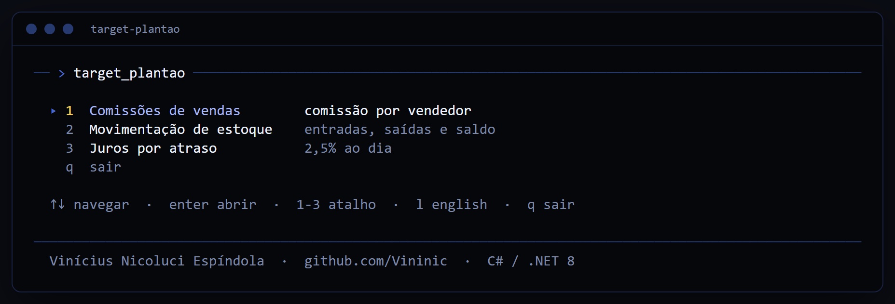
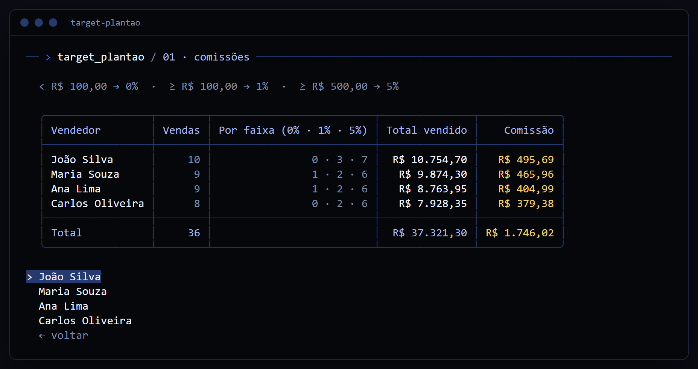
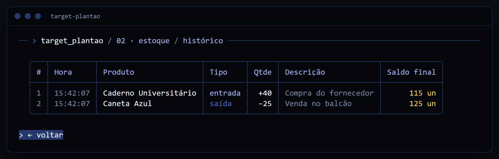
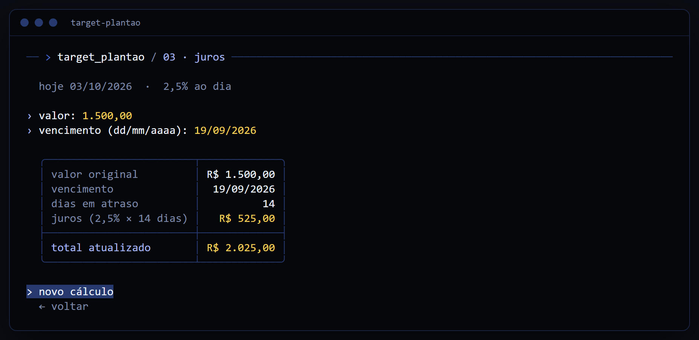

# Desafio técnico · Target — Plantão

[](https://github.com/Vininic/desafio-target-plantao/actions/workflows/ci.yml)

C# / .NET 8 · Spectre.Console · xUnit · [English](README.en.md)



## Rodar

```bash
dotnet run --project src/TargetPlantao.Cli
```

```bash
dotnet test
```

Inglês: tecla `l` no menu ou `-- --en` ao rodar.

## 1. Comissões

Comissão por vendedor a partir de [`vendas.json`](src/TargetPlantao.Cli/Data/vendas.json).

| Venda | Comissão |
|---|---|
| abaixo de R$ 100,00 | 0% |
| de R$ 100,00 a R$ 499,99 | 1% |
| a partir de R$ 500,00 | 5% |

Arredondamento por venda, antes da soma.



## 2. Estoque

Entradas e saídas sobre [`estoque.json`](src/TargetPlantao.Cli/Data/estoque.json). Cada movimentação tem id único e descrição, e retorna o saldo final do produto. Saída acima do saldo é recusada.



## 3. Juros

Juros de 2,5% ao dia sobre o valor vencido, calculados para hoje: `valor × 2,5% × dias de atraso`.



## Estrutura

```
src/TargetPlantao.Core    regras de negócio
src/TargetPlantao.Cli     interface de terminal, traduções e JSONs do enunciado
tests/TargetPlantao.Tests testes das regras e das telas
```

---

<sub>Vinícius Nicoluci Espíndola · [GitHub](https://github.com/Vininic) · [LinkedIn](https://www.linkedin.com/in/vin%C3%ADcius-nicoluci-esp%C3%ADndola-564069321/)</sub>
